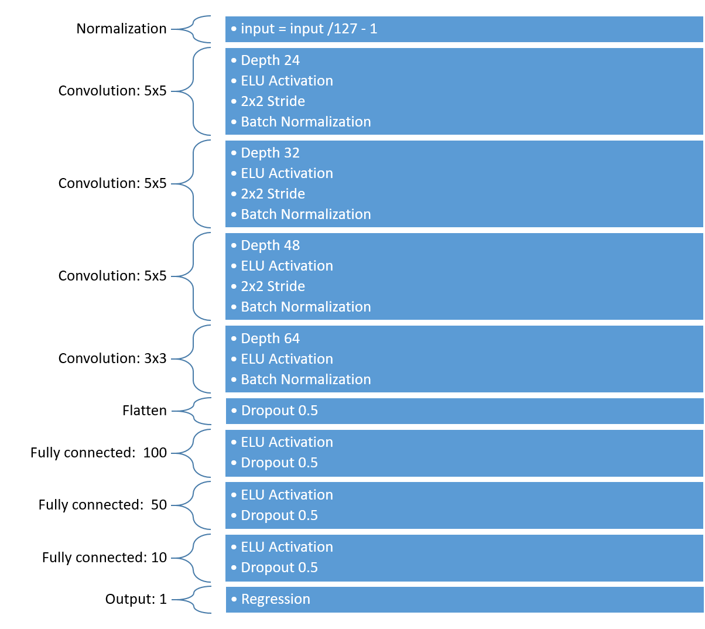
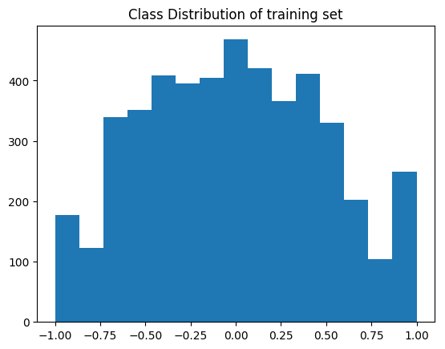
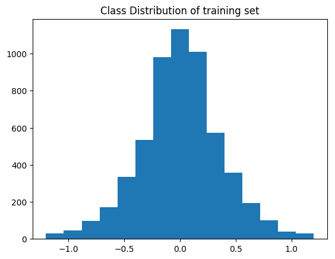

# Behavioral Cloning

### Files Submitted & Code Quality

#### 1. Submission includes all required files and can be used to run the simulator in autonomous mode

My project includes the following files:

**model.py** containing the script to create and train the model

**functions.py** containing helper functions for my network

**drive.py** for driving the car in autonomous mode

**model.h5** containing a trained convolution neural network

**writeup_report.md** summarizing the results

#### 2. Submission includes functional code Using the Udacity provided simulator and my drive.py file, the car can be driven autonomously around the track by executing

`python drive.py model.h5`
#### 3. Submission code is usable and readable

The model.py file contains the code for training and saving the convolution neural network. The file shows the pipeline I used for training and validating the model, and it contains comments to explain how the code works.

### Model Architecture and Training Strategy

#### 1. An appropriate model architecture has been employed

In order to solve this problem I used a convolutional neural network and fully connected network to act as a regression classifier. I applied ELU activation layers to introduce nonlinearity and the data is normalized in the model using a Keras lambda layer. I used strides on my convolutions to decrease dimensionality. Additionally I employed batch normalization and dropout to prevent overfitting.

#### 2. Attempts to reduce overfitting in the model

In an attempt to reduce overfitting the model contains batch normalization between convolutional layers and dropout between Fully connected layers.

The model was trained and validated on different data sets to ensure that the model was not overfitting. The model was tested by running it through the simulator and ensuring that the vehicle could stay on the track.

#### 3. Model parameter tuning

The model used an adam optimizer, so the learning rate was not tuned manually.
I chose a batch size of 128 to decrease training time.

#### 4. Appropriate training data

Training data was chosen to keep the vehicle driving on the road. I used a combination of center lane driving, recovering from the left and right sides of the road.

For details about how I created the training data, see the next section.

### Model Architecture and Training Strategy

#### 1. Solution Design Approach

The overall strategy for deriving a model architecture was to ...

My first step was to use a convolution neural network model similar to the nvidia architecture. I thought this model might be appropriate because it solves the same task as this project and has been proven to work.

In order to gauge how well the model was working, I split my image and steering angle data into a training(90%) and validation set(10%). My model never really over fit but it struggled to achieve a low MSE. I messed around with numerous models but they all had the same problem. Some would cause over steering, some would cause understeering, and some would cause biased steering. There was no rhyme or rhythm to it. This was mostly caused by my training data(Read more about that in section 3)

In addition to validating my models based on MSE, I tested them in the simulator. This allowed me to see how the network actually performed because the MSE didn't tell the entire story. Once I solved my training data problem my model was driving the car safely around the track.

#### 2. Final Model Architecture

The final model architecture was a very similar to nvidia's model but it's a bit smaller, used ELU activation, and has batch normalization and dropouts. Below you can see my final architecture:

#### 3. Creation of the Training Set & Training Process

In order to create the dataset I used the udacity dataset and then recorded my own data. I recorded about 10 laps on track one(5 forward, 5 backward). Then I recorded 4 laps on track two(2 forward, 2 backward). I then recorded 2 recovery laps on track one(1 forward and 1 backward) of the vehicle recovering from the left side and right sides of the road back to center so that the vehicle would learn to not drift outside of the lane. This process resulted in a dataset of 75,000 images.

In order to help the network generalize I preprocessed the frames by cropping them to 320x90, converting them to YUV colorspace, and adding a Gaussian blur. Below is a picture of what the image looks like before it is passed into the network:

I knew I had to augment my data in order to create a more uniform dataset.
Originally I was using every frame, from every camera and flipping it for every batch. However, even after shuffling this wasn't providing enough randomness and uniformity into the dataset. Below you can see the data before being made uniform:

So I then tried to make my data uniform by binning it based on steering angle and then trimming the bins to the average bin length. This helped make the data more uniform but greatly reduced the dataset size(which is why I ended up collecting so many laps). It lowered the MSE a bit but it still wasn't driving great. Below is the uniform data:

I ended up dropping this uniformity approach because it didn't properly introduce randomness into the data(I am not totally sure why).

I re-solved the uniformity problem by randomly dropping frames with steering angles < 0.1 with a probability of 70%. I solved the randomness problem by randomly selecting a frame(shuffling), randomly selecting a camera, and randomly flipping the samples while generating my batches. This worked great and my car drove super smooth in the simulator. Below is the final distribution of my data:

I then did a 90/10 split for training/validation sets. I used this training data for training the model. The validation set helped determine if the model was over or under fitting. The ideal number of epochs was 5 as evidenced by my model driving well. I am sure I could do more epochs but since it was working, I didn't want to spend anymore money on AWS. I used an adam optimizer so that manually training the learning rate wasn't necessary.
